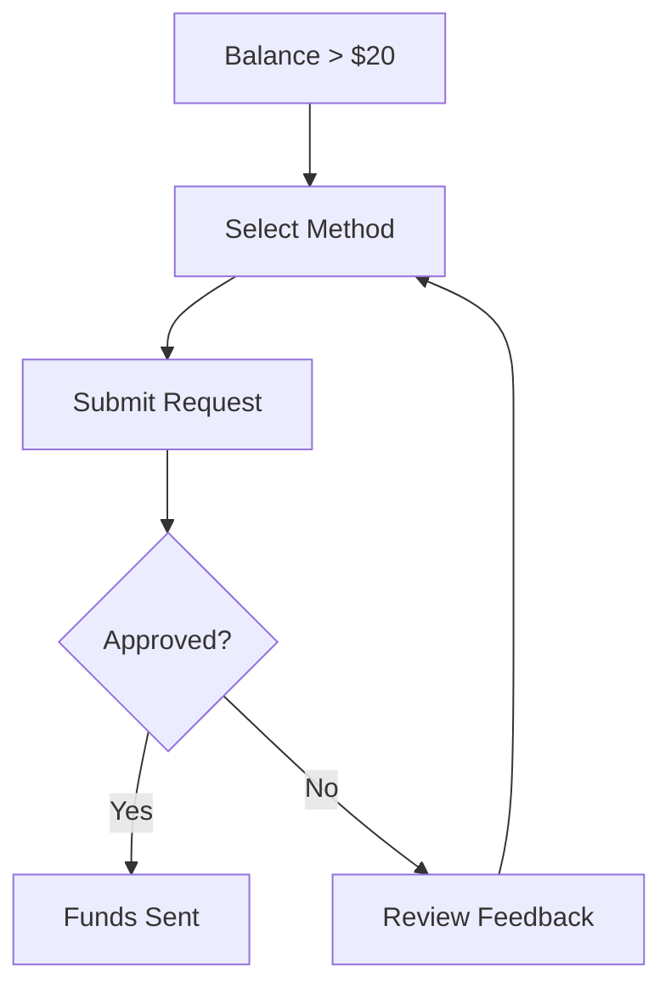

## Understanding Task Rewards

Feedquire rewards you for each AI testing task you complete. Tasks typically pay between `$5` and `$14`, depending on complexity, duration, and required expertise. Simple feedback tasks might earn you `$5-7`, while in-depth usability tests or edge-case evaluations pay up to `$14`.

Rewards appear in your dashboard immediately after task approval, usually within 24 hours. Track your earnings via the [Earnings tab](https://dashboard.example.com/earnings) in your account.

<Callout kind="success">
  Pro tip: Complete tasks quickly and provide detailed, authentic feedback to increase approval rates and unlock bonus multipliers.
</Callout>

| Task Type | Reward Range | Estimated Time |
|-----------|--------------|----------------|
| Basic Feedback | `$5-$7` | 10-15 minutes |
| Usability Test | `$8-$11` | 20-30 minutes |
| Advanced Evaluation | `$12-$14` | 45+ minutes |

## Payment Thresholds and Methods

You can withdraw earnings once you reach the minimum threshold of `$20`. No fees apply for standard methods, but processing times vary.

<Tabs>
  <Tab title="PayPal" icon="dollar-sign">
    Fastest option for most users. Withdrawals process in 1-2 business days.
    
    <Callout kind="info">
      Link your PayPal account in [Settings > Payouts](https://dashboard.example.com/settings/payouts).
    </Callout>
  </Tab>
  
  <Tab title="Bank Transfer" icon="banknote">
    Ideal for larger amounts (`>$100`). Takes 3-5 business days.
    
    Add your bank details securely via the dashboard. Supports ACH in the US and SEPA in Europe.
  </Tab>
  
  <Tab title="Crypto (USDC)" icon="dollar-sign">
    Instant withdrawals with low fees. Receive funds on Ethereum or Polygon networks.
    
    Generate a wallet address in your payout settings.
  </Tab>
</Tabs>

## Withdrawal Process

Follow these steps to cash out your earnings:

<Steps>
  <Step title="Check Balance" icon="wallet">
    Navigate to your [Earnings page](https://dashboard.example.com/earnings) and verify your balance exceeds `$20`.
  </Step>
  
  <Step title="Select Method" icon="settings">
    Go to [Payouts](https://dashboard.example.com/settings/payouts) and choose your preferred method.
    
````jsx
// Example payout request (for reference)
const payout = {
  amount: 25.50,
  method: "paypal",
  email: "user@example.com"
};
````
  </Step>
  
  <Step title="Confirm and Submit" icon="check-circle">
    Review details and submit. You'll receive a confirmation email.
  </Step>
  
  <Step title="Track Status" icon="clock">
    Monitor progress in the [Transactions log](https://dashboard.example.com/transactions).
  </Step>
</Steps>



## Tips for Higher-Paying Opportunities

Maximize your income by focusing on high-value tasks.

<Columns cols={3}>
  <Card title="Complete Profile" icon="user-check" href="https://dashboard.example.com/profile">
    Fully verify your skills and experience to access premium tasks.
  </Card>
  
  <Card title="High Accuracy" icon="target" href="#">
    Maintain 95%+ approval rate for priority access to `$12+` tasks.
  </Card>
  
  <Card title="Daily Goals" icon="calendar" href="#">
    Aim for 5-10 tasks daily during peak hours (weekdays 9AM-5PM UTC).
  </Card>
</Columns>

<Callout kind="tip">
  Join the Feedquire Discord for exclusive high-pay alerts: [discord.feedquire.com](https://discord.feedquire.com).
</Callout>

## Tax and Compliance Information

<ExpandableGroup>
  <Expandable title="US Tax Requirements" default-open="true">
    Earnings are reported as 1099-MISC income if you exceed `$600` annually. Feedquire sends forms by January 31.
    
    Track expenses like internet costs for deductions. Consult a tax professional for advice.
  </Expandable>
  
  <Expandable title="International Compliance">
    Non-US users may need to handle VAT/GST. Provide tax ID during payout setup.
    
    Withdrawals comply with local regulations; crypto users handle their own reporting.
  </Expandable>
  
  <Expandable title="Dispute Policy">
    If a payout is delayed, contact support within 7 days with transaction ID.
  </Expandable>
</ExpandableGroup>