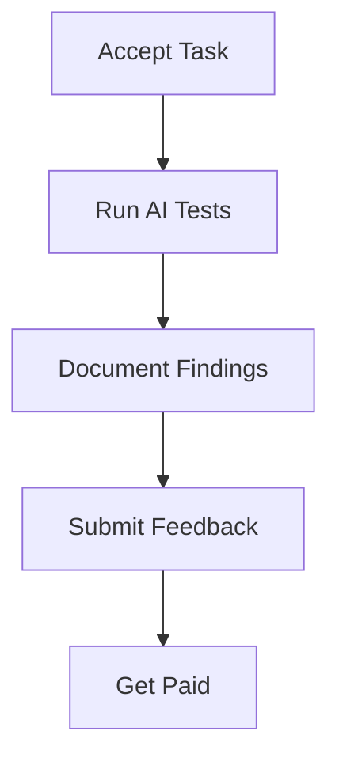

## Overview

Feedquire provides intuitive tools to help you discover, test, and give feedback on AI systems. Earn up to `$14` per task by selecting from a global pool of opportunities tailored to your skills. The platform streamlines every step, from task discovery to payment tracking, while fostering community collaboration.

<Callout kind="info">
  All tasks require authentic, detailed feedback to improve AI models. Complete profiles unlock higher-paying opportunities.
</Callout>

## Key Features

<Columns cols={3}>
  <Card title="Task Search" icon="search" href="#searching-tasks">
    Find AI testing opportunities matching your expertise in seconds.
  </Card>
  <Card title="Testing Workflow" icon="play-circle" href="#testing-process">
    Follow guided steps to evaluate AI performance systematically.
  </Card>
  <Card title="Feedback Tools" icon="edit-3" href="#submitting-feedback">
    Submit rich feedback with multimedia support.
  </Card>
  <Card title="Earnings Tracker" icon="trending-up" href="#tracking">
    Monitor task history, payments, and payouts in real-time.
  </Card>
  <Card title="Community Hub" icon="users" href="#community">
    Connect with testers worldwide for tips and collaboration.
  </Card>
</Columns>

## Searching and Selecting Tasks

Browse thousands of AI testing tasks categorized by type, such as chatbot evaluation, image recognition, or code generation testing.

Use advanced filters for duration (`<15min`), payout (`>$10`), or AI domain (NLP, vision). Tasks appear with previews showing expected effort and sample AI prompts.

| Filter Type | Description | Example Values |
|-------------|-------------|----------------|
| Payout     | Minimum earnings | `> $5`, `$10+` |
| Duration   | Time required | `< 10min`, `15-30min` |
| Category   | AI focus area | Chatbots, Vision AI |
| Skill Level| Experience needed | Beginner, Expert |

<Callout kind="tip">
  Bookmark searches to get notifications for new high-paying tasks matching your criteria.
</Callout>

## Step-by-Step Testing Process

Follow this structured workflow to complete tasks efficiently.

<Steps>
  <Step title="Accept Task" icon="check-circle">
    Review task details and accept within the time limit.
  </Step>
  <Step title="Run Tests" icon="zap">
    Interact with the AI system using provided prompts.
    
    Example interaction:
    
    ````plaintext
    Prompt: "Generate a poem about autumn."
    AI Output: [Observe response quality]
    Your Notes: Rhyme scheme, creativity score (1-10)
    ````
  </Step>
  <Step title="Document Results" icon="file-text">
    Capture screenshots, record sessions, or note edge cases.
  </Step>
  <Step title="Submit for Review" icon="upload">
    Package your findings and submit before deadline.
  </Step>
</Steps>



## Submitting Authentic Feedback

Provide detailed, honest input to help AI developers iterate. Use structured forms with ratings, text, and attachments.

<Tabs>
  <Tab title="Text Feedback" icon="edit">
    Write comprehensive reviews.
    
    ```
    Strengths: Accurate responses in 90% of cases.
    Issues: Fails on ambiguous queries >20% time.
    Suggestions: Add context awareness.
    ```
  </Tab>
  <Tab title="Multimedia" icon="image">
    Upload screenshots or videos.
    
    Supported formats: PNG, MP4 (`<100MB`).
  </Tab>
  <Tab title="Ratings" icon="star">
    Score on scales like accuracy (1-5), speed, creativity.
  </Tab>
</Tabs>

## Tracking Task History and Payments

Access your dashboard to view completed tasks, pending reviews, and earnings. Payments process weekly via PayPal or bank transfer once approved.

<Expandable title="Payment Details" default-open="true">
  - Minimum payout: `$25`
  - Approval time: `24-48 hours`
  - History export: CSV download available
</Expandable>

## Community Interaction Tools

Engage with other testers through forums, leaderboards, and direct messaging. Share strategies for tough tasks or collaborate on complex evaluations.

<Columns cols={2}>
  <Card title="Forums" icon="message-circle" horizontal>
    Discuss AI trends and task tips.
  </Card>
  <Card title="Leaderboards" icon="award" horizontal>
    Compete for top earner badges and bonuses.
  </Card>
</Columns>

Ready to start? Head to your dashboard at `https://app.feedquire.com` and claim your first task today.