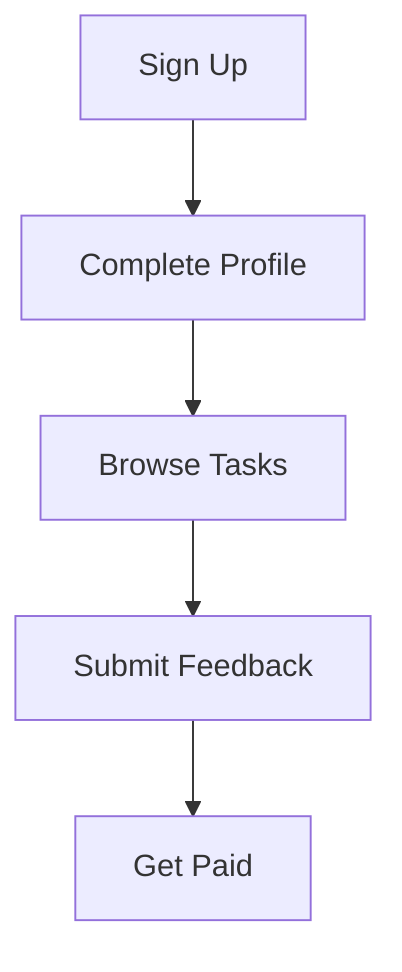

## Overview

Feedquire connects you with opportunities to test cutting-edge AI systems and earn money for your feedback. Join a global community of testers who complete simple tasks and contribute to AI development while earning up to `$14` per task. You provide authentic insights that help improve AI platforms, all through an intuitive dashboard.

<Callout kind="info">
  Feedquire prioritizes real user experiences—no technical expertise required.
</Callout>

## Key Features

Feedquire stands out with features designed for easy participation and maximum rewards.

<Columns cols={3}>
  <Card title="Earn Up to $14/Task" icon="dollar-sign" href="#earning-potential">
    Complete quick tests and get paid instantly via PayPal or bank transfer.
  </Card>
  <Card title="Global Community" icon="globe" href="#community">
    Join thousands worldwide, collaborating on diverse AI projects.
  </Card>
  <Card title="AI Impact" icon="zap" href="#contribute">
    Your feedback directly shapes the future of AI technology.
  </Card>
</Columns>

## How It Works

Feedquire simplifies testing with a straightforward process.

This flow ensures you start earning quickly.

## Get Started in Minutes

Follow these steps to begin testing and earning.

<Steps>
  <Step title="Create Account" icon="user-plus">
    Visit [app.feedquire.com](https://app.feedquire.com) and sign up with your email.

    <Image
      src="https://via.placeholder.com/800x400/040454/ffffff?text=Sign+Up+Screen"
      alt="Feedquire sign-up screen"
      width="800"
      height="400"
    />
  </Step>
  <Step title="Verify Profile" icon="check-circle">
    Add basic details like location and payment info to unlock tasks.
  </Step>
  <Step title="Pick a Task" icon="play-circle">
    Browse available AI tests matching your interests.
  </Step>
  <Step title="Submit & Earn" icon="dollar-sign">
    Provide feedback and receive payment within 24 hours.
  </Step>
</Steps>

## Earning Potential

<Callout kind="success" default-open="true">
  Tasks pay between `$5-$14` based on complexity. High-volume testers earn `$200+` weekly.
</Callout>

<Tabs>
  <Tab title="Beginner" icon="user">
    Start with simple UI tests earning `$5-$8` per task.
  </Tab>
  <Tab title="Experienced" icon="star">
    Advanced AI evaluations pay up to `$14` with detailed feedback.
  </Tab>
</Tabs>

## Join the Community

<Expandable title="Why Contribute to AI?" default-open="false">
  Your input helps developers fix biases, improve accuracy, and enhance user experiences in AI systems. Feedquire's global network ensures diverse perspectives from testers worldwide.
</Expandable>

Ready for more? Explore [Quickstart](/quickstart) for your first task or [Tasks Guide](/tasks) for tips.

---